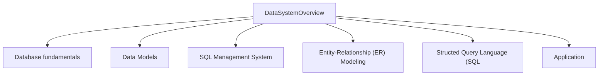

<h1>Ex1: </h1>

  

```mermaid
flowchart TD
    A1["DataSystemOverview"] --> B1["Database fundamentals"]
    A1["DataSystemOverview"] --> B2["Data Models"]
    A1["DataSystemOverview"] --> B3["SQL Management System"]
    A1["DataSystemOverview"] --> B4["Entity-Relationship (ER) Modeling"]
    A1["DataSystemOverview"] --> B5["Structed Query Language (SQL"]
    A1["DataSystemOverview"] --> B6["Application"]
```

<h1>Ex2: </h1>
<h1>Ex3: </h1>
<h1>Ex4: </h1>
<h1>Ex5: </h1>
<h1>Ex6: </h1>
<h1>Ex7: </h1>
