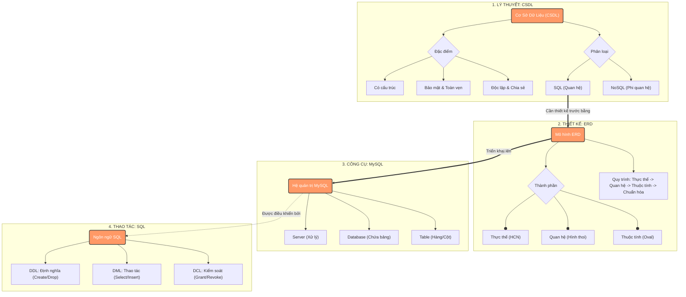

<h1>Ex1: </h1>

  

<h1>Ex2: </h1>
<h3>Có 3 thực thể chính</h4>
<ul>
  <li>Sinh Viên>Sinh
  <li>Môn Học>Mô>l
  <li>Mục Tiêu Học>Mục>
</ul>
<h3>2. Các thuộc tính cơ bản của từng thực thể</h3>

thực thể sinh viên: Mã Sinh viên, tên Sinh viên 

thực thể Môn Học: Mã môn học, tên môn học, số tín chỉ 

thựcthể sinh viên: Mã mục tiêu, nội dung mục tiêu 

<h3>3. Mối quan hệ giữa các thực thể</h3>

Một sinh viên, có thể học nhiều môn

Một môn học có thể có nhiều học sinh>Mp>

Môn môn học có thể có nhiều mục tiêu

Mỗi mục tiêu học tập chỉ thuộc về một môn học>Mp>

<h1>Ex3: </h1>
<h1>Ex4: </h1>
<h1>Ex5: </h1>
<h1>Ex6: </h1>
<h1>Ex7: </h1>
