#1

```mermaid
flowchart TD
    A[THAO TAC DU LIEU SQL]

    %% INSERT
    A --> I[Lesson 01 INSERT - Them moi]
    I --> I1[Khai niem]
    I1 --> I1a[Thuoc nhom DML]
    I1 --> I1b[Muc tieu Them dong moi vao bang]

    I --> I2[Cu phap chi tiet]
    I2 --> I2a[Chen don INSERT INTO table cols VALUES vals]
    I2 --> I2b[Chen hang loat VALUES row1 row2 row3]
    I2 --> I2c[Chen tu bang khac INSERT INTO table_dest SELECT]

    I --> I3[Luu y quan trong]
    I3 --> I3a[NOT NULL Bat buoc co gia tri]
    I3 --> I3b[Auto Increment Khong can truyen ID]
    I3 --> I3c[DEFAULT Dung gia tri mac dinh]
    I3 --> I3d[Dinh dang ngay YYYY-MM-DD]

    %% UPDATE
    A --> U[Lesson 02 UPDATE - Cap nhat]
    U --> U1[Khai niem]
    U1 --> U1a[Thay doi du lieu dang ton tai]
    U1 --> U1b[Khong thay doi cau truc bang]

    U --> U2[Cu phap]
    U2 --> U2a[UPDATE table SET col bang val WHERE condition]

    U --> U3[Chien luoc an toan]
    U3 --> U3a[Cap nhat theo khoa chinh]
    U3 --> U3b[Cap nhat hang loat BETWEEN IN LIKE]

    U --> U4[Canh bao]
    U4 --> U4a[Quen WHERE Ghi de toan bo bang]
    U4 --> U4b[Meo SELECT truoc khi UPDATE]

    %% DELETE
    A --> D[Lesson 03 DELETE - Xoa]
    D --> D1[Khai niem]
    D1 --> D1a[Xoa du lieu]
    D1 --> D1b[Khac DROP va TRUNCATE]

    D --> D2[Cu phap]
    D2 --> D2a[DELETE FROM table WHERE condition]

    D --> D3[Cac kich ban]
    D3 --> D3a[Xoa theo ID]
    D3 --> D3b[Xoa theo logic Status]

    D --> D4[Canh bao]
    D4 --> D4a[Quen WHERE Xoa sach bang]
    D4 --> D4b[Bi chan boi Foreign Key]

    %% SELECT
    A --> S[Lesson 04 SELECT - Truy xuat]
    S --> S1[Khai niem]
    S1 --> S1a[Thuoc nhom DQL]
    S1 --> S1b[Chi doc du lieu]
    S1 --> S1c[Ket qua la Result Set]

    S --> S2[Ky thuat co ban]
    S2 --> S2a[SELECT all Chi dung kiem tra]
    S2 --> S2b[SELECT cot cu the]

    S --> S3[Ky thuat nang cao]
    S3 --> S3a[WHERE ket hop AND OR NOT]
    S3 --> S3b[ORDER BY tang giam]
    S3 --> S3c[LIMIT hoac TOP]

    S --> S4[Loi ich thuc te]
    S4 --> S4a[Phan tich du lieu]
    S4 --> S4b[Hien thi Web App]
    S4 --> S4c[Kiem tra INSERT UPDATE DELETE]
```



#2
```sql
create table students(
    studentsId int primary key,
    fullName varChar(255) not null ,
    dateOfBirth date  ,
    email VARCHAR(255) not null unique
);
insert into students(studentsId, fullName, dateOfBirth, email)
values
    (4, 'Nguyen Van A', '2003-05-11', 'anguy1n@gmail.com'),
    (2, 'Nguyen Van B', '2003-05-12', 'anguy2n@gmail.com'),
    (3, 'Nguyen Van C', '2003-05-15', 'anguy3n@gmail.com');
```

#3

```sql

update students
set email = 'minh.le@sv.edu.vn'
where students.studentsId = 3;

update students
set dateOfBirth = '2003-06-06'
where students.studentsId = 2;

DELETE  FROM students
where students.studentsId = 4;


SELECT * FROM students;

```

#4

```sql


Create table subject (
    subjectId int primary key,
    subjectName varChar(255) not null,
    creditNumber int check ( creditNumber > 0 )
);

insert subject
values
    (1,'CSDL', 16),
    (2, 'LTHDT', 12),
    (3, 'LTTD', 8);

update subject
set creditNumber = 15
where subject.subjectId = 3;

update subject
set subjectName = 'Co So Du Lieu'
where subject.subjectName = 'CSDL';

select *from subject
```

#5
```sql

create table students (
    studentsId int primary key,
    studentName varchar(255) not null,
    DOB date,
    email varchar(255) not null unique
);

create table subject (
    subjectId int primary key ,
    subjectName varchar(255) not null ,
    credit int check ( credit > 0 ) not null
);

CREATE TABLE enrollment (
    studentId INT,
    subjectId INT,
    enrollDate DATE DEFAULT (CURRENT_DATE),

    PRIMARY KEY (studentId, subjectId),

    FOREIGN KEY (studentId) REFERENCES students(studentsId),
    FOREIGN KEY (subjectId) REFERENCES subject(subjectId)
);


insert into students (studentsId, studentName, DOB, email)
values
    (1, 'Nguyen Van A', '2003-05-11', 'ngiuyen1@gmai.com'),
    (2, 'Nguyen Van B', '2003-05-12', 'ngiuyen2@gmai.com'),
    (3, 'Nguyen Van C', '2003-05-13', 'ngiuyen3@gmai.com');


insert into subject (subjectId, subjectName, credit)
values
    (101, 'CSDL', 14),
    (102, 'Java', 12),
    (103, 'React', 21);


insert into enrollment(studentId, subjectId)
values
    (1,101),
    (1,103),
    (2,102),
    (3,101);


select * from subject;


select * from students;

select * from enrollment;

select *  from enrollment
where studentId = 1;

select *  from enrollment
where studentId = 2;


```

#6
```sql

create table students (
    studentsId int primary key,
    studentName varchar(255) not null,
    DOB date,
    email varchar(255) not null unique
);

create table subject (
    subjectId int primary key ,
    subjectName varchar(255) not null ,
    credit int check ( credit > 0 ) not null
);


create table Score (
    studentId int,
    subjectId int,
    mid_Score int check(mid_Score > 0 and mid_Score < 11),
    final_Score int check(final_Score > 0 and final_Score < 11),
    primary key (studentId, subjectId),

    foreign key (studentId) references students(studentsId),
    foreign key (subjectId) references subject(subjectId)
);

insert Score
values
    (1, 101, 7, 9),
    (2, 101, 6, 6),
    (3, 101, 5, 9);


select * from Score;

select * from Score
where final_Score > 8;


```

#7
```sql


create table students (
    studentsId int primary key,
    studentName varchar(255) not null,
    DOB date,
    email varchar(255) not null unique
);

create table subject (
    subjectId int primary key ,
    subjectName varchar(255) not null ,
    credit int check ( credit > 0 ) not null
);

CREATE TABLE enrollment (
    studentId INT,
    subjectId INT,
    enrollDate DATE DEFAULT (CURRENT_DATE),

    PRIMARY KEY (studentId, subjectId),

    FOREIGN KEY (studentId) REFERENCES students(studentsId),
    FOREIGN KEY (subjectId) REFERENCES subject(subjectId)
);

create table Score (
    studentId int,
    subjectId int,
    mid_Score int check(mid_Score > 0 and mid_Score < 11),
    final_Score int check(final_Score > 0 and final_Score < 11),
    primary key (studentId, subjectId),

    foreign key (studentId) references students(studentsId),
    foreign key (subjectId) references subject(subjectId)
);


insert enrollment(studentId, subjectId)
values
    (1, 101),
    (1, 102);


insert Score
values
    (1, 101, 7, 9),
    (1, 102, 6, 6);


SELECT * FROM Score WHERE studentId = 1;


UPDATE Score
SET final_Score = 9
WHERE studentId = 1
  AND subjectId = 102;


DELETE FROM enrollment
WHERE studentId = 1
  AND subjectId = 102;

SELECT * FROM enrollment WHERE studentId = 1;


SELECT
    s.studentsId,
    s.studentName,
    sub.subjectName,
    sc.mid_Score,
    sc.final_Score
FROM Score sc
JOIN students s ON sc.studentId = s.studentsId
JOIN subject sub ON sc.subjectId = sub.subjectId
ORDER BY s.studentsId;

```

```sql

create table students (
    studentsId int primary key,
    studentName varchar(255) not null,
    DOB date,
    email varchar(255) not null unique
);

create table subject (
    subjectId int primary key ,
    subjectName varchar(255) not null ,
    credit int check ( credit > 0 ) not null
);

CREATE TABLE enrollment (
    studentId INT,
    subjectId INT,
    enrollDate DATE DEFAULT (CURRENT_DATE),

    PRIMARY KEY (studentId, subjectId),

    FOREIGN KEY (studentId) REFERENCES students(studentsId),
    FOREIGN KEY (subjectId) REFERENCES subject(subjectId)
);

create table Score (
    studentId int,
    subjectId int,
    mid_Score int check(mid_Score > 0 and mid_Score < 11),
    final_Score int check(final_Score > 0 and final_Score < 11),
    primary key (studentId, subjectId),

    foreign key (studentId) references students(studentsId),
    foreign key (subjectId) references subject(subjectId)
);


insert enrollment(studentId, subjectId)
values
    (1, 101),
    (1, 102);


insert Score
values
    (1, 101, 7, 9),
    (1, 102, 6, 6);


SELECT * FROM Score WHERE studentId = 1;


UPDATE Score
SET final_Score = 9
WHERE studentId = 1
  AND subjectId = 102;


DELETE FROM enrollment
WHERE studentId = 1
  AND subjectId = 102;

SELECT * FROM enrollment WHERE studentId = 1;


SELECT
    s.studentsId,
    s.studentName,
    sub.subjectName,
    sc.mid_Score,
    sc.final_Score
FROM Score sc
JOIN students s ON sc.studentId = s.studentsId
JOIN subject sub ON sc.subjectId = sub.subjectId
ORDER BY s.studentsId;


#thêm Cột phone cho student
ALTER TABLE students
ADD phone VARCHAR(15);

#thêm cột smester cho students
Alter table subject
add semester varchar(255);

#thay doi kieu du liẹu
ALTER TABLE subject
MODIFY semester int;


#kiem tra du liẹu sai
SELECT *
FROM subject
WHERE credit < 1;


# Trong bảng subject, cột semester không cần thiết vì:
# 	•	Học kỳ không phải thuộc tính cố định của môn học
# 	•	Học kỳ phù hợp hơn nếu gắn với đăng ký học (DangKy), không phải subject

#xoá cột khong cần thiết
ALTER TABLE subject
DROP COLUMN semester;


DESCRIBE students;
DESCRIBE subject;
DESCRIBE enrollment;

SHOW CREATE TABLE students;
```


