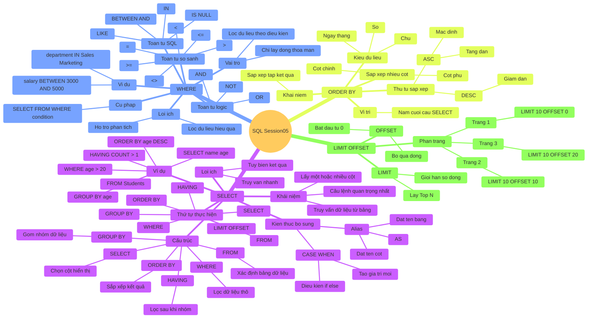

#Ex1



#Ex2
```sql


create table products (
    productId int auto_increment primary key ,
    productName varchar(255) not null ,
    price DECIMAL(10,2) not null ,
    stock int,
    status ENUM('active', 'inactive')
);

insert into products(productName, price, stock, status)
values
    ('Cake', 5.00, 10, 'active'),
    ('Cake1', 6.00, 20, 'inactive'),
    ('Cake2', 7.00, 30, 'active'),
    ('Cake3', 3000000, 40, 'inactive'),
    ('Cake4', 9.00, 50, 'active');


select * from products;


select *
from products
where products.status = 'active';


select *
from products
where products.price > 1000000;

select *
from products
where status ='active'
order by price ;
```


#Ex3
```sql


create table customer (
    customer_id int auto_increment primary key,
    full_name varchar(225) not null ,
    email varchar(255) unique  not null ,
    city varchar(255) not null ,
    status ENUM('active', 'inactive')
);


insert into customer(full_name, email, city, status)
values
    ('Nguyen Van A', 'anguyen@gmail.com', 'HN', 'active'),
    ('Nguyen Van B', 'bnguyen@gmail.com', 'HCM', 'inactive'),
    ('Nguyen Van C', 'cnguyen@gmail.com', 'HN', 'active'),
    ('Nguyen Van D', 'dnguyen@gmail.com', 'HCM', 'inactive'),
    ('Nguyen Van E', 'enguyen@gmail.com', 'HN', 'active');


select *
from customer;

select * from customer
where city = 'HCM';

select *
from customer
where city ='HN' and status = 'active';

select *
from customer
order by customer.full_name;
```

#Ex4
```sql


create table OrderTable(
    order_id int auto_increment primary key ,
    customer_id int not null ,
    total_amount decimal(10,2),
    order_date Date,
    status ENUM('Pending', 'completed', 'cancelled')
);


insert into OrderTable (customer_id, total_amount, order_date, status)
values  (1, 10000, '2025/12/30', 'completed'),
        (2, 200000, '2025/12/30', 'completed'),
        (4, 30000, '2025/12/30', 'Pending'),
        (3, 210000, '2025/12/30', 'completed'),
        (5, 240000, '2025/12/30', 'completed'),
        (6, 2220000, '2025/12/30', 'cancelled');


SELECT *
FROM OrderTable
WHERE status = 'completed';

SELECT *
FROM OrderTable
WHERE total_amount > 500000;

select * from OrderTable
order by order_id desc
LIMIT 5;

select *from OrderTable
where status = 'completed'
order by total_amount DESC;
```
#Ex5
```sql


alter table products
add sold_quantity int;

INSERT INTO products (productName, price, stock, status, sold_quantity) VALUES
('Áo thun nam', 150000, 100, 'active', 20),
('Áo thun nữ', 160000, 80, 'active', 15),
('Quần jean nam', 350000, 60, 'active', 25),
('Quần jean nữ', 370000, 50, 'active', 18),
('Áo sơ mi', 280000, 70, 'active', 22),
('Áo khoác', 520000, 40, 'active', 10),
('Váy công sở', 450000, 30, 'active', 12),
('Chân váy', 220000, 45, 'inactive', 8),
('Áo hoodie', 480000, 55, 'active', 30),
('Áo len', 390000, 35, 'active', 14),
('Giày thể thao', 750000, 25, 'active', 20),
('Giày da', 980000, 20, 'active', 9),
('Dép nam', 120000, 90, 'inactive', 5),
('Dép nữ', 130000, 85, 'active', 7),
('Túi xách', 650000, 40, 'active', 16),
('Balo', 550000, 50, 'active', 19),
('Thắt lưng', 180000, 100, 'active', 11),
('Nón thời trang', 90000, 120, 'active', 6),
('Vớ', 50000, 200, 'active', 40),
('Khăn choàng', 210000, 65, 'inactive', 4);


select * from products;


select * from products
order by sold_quantity DESC
limit 10;

select * from products
order by sold_quantity DESC
limit 5 offset 10;


select * from products
where price < 2000000
order by sold_quantity DESC

```
#Ex6

```sql

select * from products;

select * from products
where status = 'active'
limit 5 offset 0;

select * from products
where status = 'active'
limit 5 offset 5;

select * from products
where status = 'active'
limit 5 offset 10;
```
#Ex7
```sql
select * from products
where status = 'active'
and price between 10000 and 300000
order by price
limit 10 offset 0;

select * from products
where status = 'active'
and price between 10000 and 3000000
order by price
limit 10 offset 10
```
